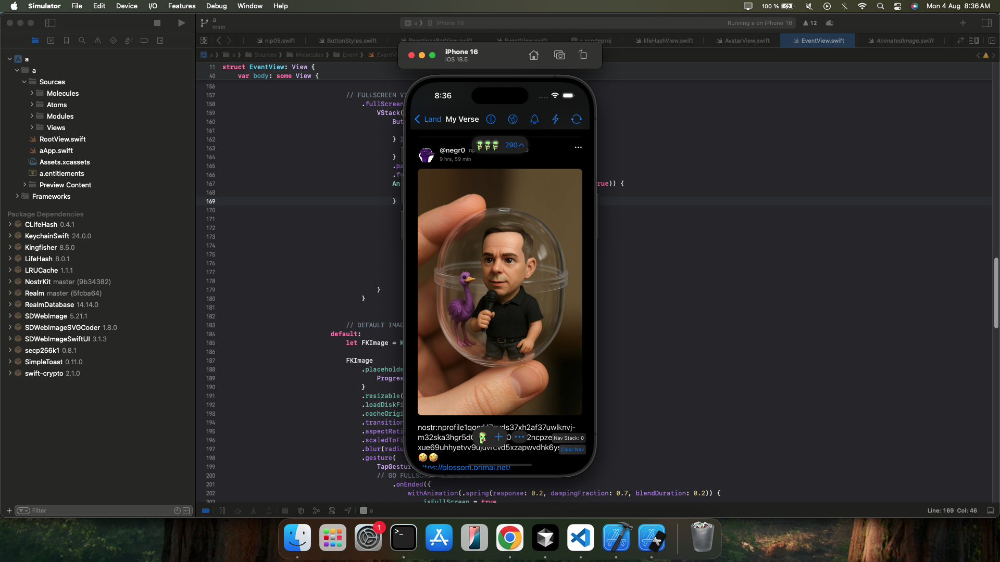

# Nostr Swift Client

Welcome to the Nostr Swift Client repository! This project aims to provide a robust and easy-to-use Swift implementation for interacting with the Nostr protocol.

## About Nostr

Nostr (Notes and Other Stuff Transmitted by Relays) is a simple, open, and decentralized protocol that enables a global, censorship-resistant social network. It's built on a foundation of cryptographic keys and relays, allowing for a truly open and resilient communication platform.

## Features

This client is designed to offer:

* **Relay Communication:** Connect to and interact with Nostr relays.
* **Event Handling:** Send and receive various Nostr event types.
* **Key Management:** Securely handle Nostr private and public keys.
* **User Interface (WIP):** A user-friendly interface for interacting with the Nostr network (as seen in the screenshot).
* **Swift Native:** Built entirely in Swift, leveraging Apple's ecosystem.

## Getting Started

### Prerequisites

* Xcode (latest stable version recommended)
* Swift (latest stable version recommended)

### Installation

Clone the repository:

```bash
git clone https://github.com/dfralan/a.git
cd a
```

Open in Xcode:

* Open the `.xcodeproj` or `.xcworkspace` file in Xcode.

Build and Run:

* Select your target device or simulator and build and run the project.

## Usage

Once the application is running, you can:

* Connect to Nostr relays.
* Create and publish Nostr events (e.g., text notes).
* Subscribe to events from other users.
* Manage your Nostr identity.

(Further detailed usage instructions will be added as the project matures.)

## Contributing

Contributions are highly welcome! If you'd like to contribute, please follow these steps:

1. Fork the repository.
2. Create a new branch (`git checkout -b feature/your-feature-name`).
3. Make your changes.
4. Commit your changes (`git commit -m 'Add some feature'`).
5. Push to the branch (`git push origin feature/your-feature-name`).
6. Open a Pull Request.

Please ensure your code adheres to Swift best practices and includes appropriate tests.

## License

This project is licensed under the MIT License.

## Contact

If you have any questions or feedback, feel free to reach out to me:

* GitHub: [@dfralan](https://github.com/dfralan)

Feel free to try it!
